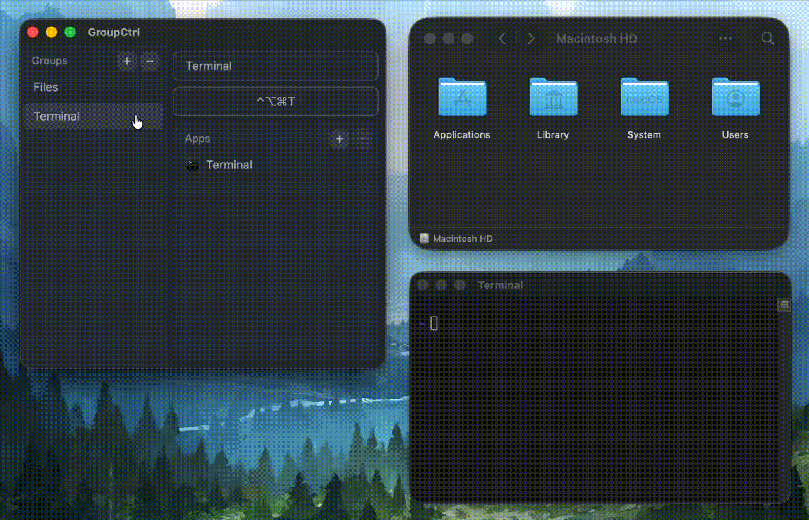

<h1>
  <sub></sub>
  GroupCtrl
</h1>

Gain control over your apps with hotkeys for app groups



`brew install brodmo/tap/groupctrl` or
download from [Releases](https://github.com/brodmo-dev/GroupCtrl/releases/latest)

## Features

- **Instant app switching** – Reliable & predictable behavior
- **Shared hotkeys** – Group related apps and assign a single hotkey to them
- **App launcher** – Hold a group hotkey to launch apps that aren't running
- **Text config** – Easy to manually edit and version-control, if you're so inclined

## Tips

- Add GroupCtrl to `Open at Login` in System Settings
- Use [Hyperkey](https://hyperkey.app/) or [Karabiner](https://karabiner-elements.pqrs.org/)
  to map Caps Lock to `Cmd+Opt+Control`
- Config path is `~/.config/groupctrl/config.yaml`. It looks like this:
  ```yaml
  groups:
  - name: Files
    hotkey: Cmd+Opt+Ctrl+F
    apps:
    - com.apple.finder
    - com.apple.Preview
    - com.sublimetext.4
  - name: Terminal
    hotkey: Cmd+Opt+Ctrl+T
    apps:
    - com.apple.Terminal
  ```

### Useful macOS shortcuts

- `Cmd+Opt+D` to hide Dock
- `Cmd+Backtick` to switch between windows of an app
- `F11` to show desktop

## Privacy

GroupCtrl is 100% offline and does not gather any user data.

## Alternatives

- [rcmd](https://lowtechguys.com/rcmd/) – Similar functionality, but shared hotkeys aren't practical
- [FlashSpace](https://github.com/wojciech-kulik/FlashSpace) – Workspace manager with app hiding
- [AeroSpace](https://github.com/nikitabobko/AeroSpace) – Tiling window manager

I've used all three extensively but was never quite satisfied.
I wanted to build something that combines the simplicity of rcmd
with the flexibility of FlashSpace and the consistency of AeroSpace.

## Roadmap

- [x] Add launcher pop-up
- [ ] Complete Windows port
    - [ ] Custom app picker
    - [ ] Windows app enumeration for picker
    - [ ] Windows app metadata extraction
    - [ ] Windows app launching
    - [ ] Windows window tracking
    - [ ] UWP app support

## Development

- Requires `npm`
- Run with `cargo run`

### Hot reload (macOS only)

- One-time: `cargo install dioxus-cli`
- `dx serve` & `npm run watch`
